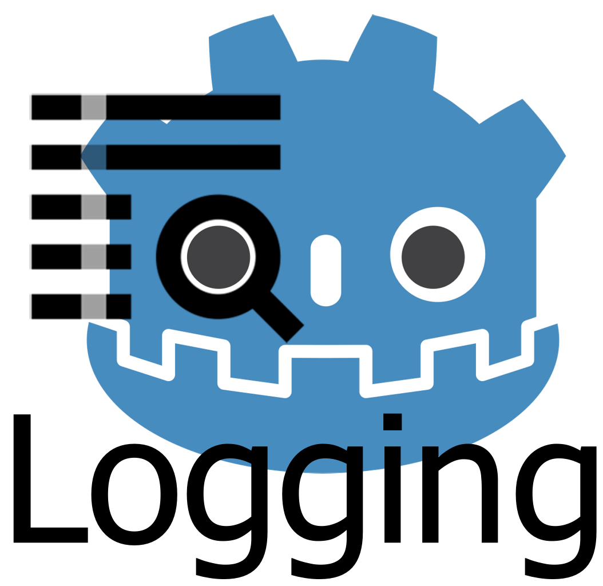

# Godot Logging Util



A logging util for Godot Engine 3.0

## Features

- Print detailed logs.
- Write to log files.
- Supports use of multiple log files.


## How to use

## Add to Global Autoload
Select Project -> Project Settings, and choose the AutoLoad tab.  
Select the `logger.gd` script, and give it a good name.
> Recommend you use the name **Logger** as the global variable.


## Preparing the Logger
By default we expect the script name to be used as the argument for the `get_logger` method.

```
var Log = Logger.get_logger("script_name_goes_here.gd")
```

This will prepare a default `FileWriter` that will write the logs to a file found in `user://` directory. This behavior can be overridden by adding additional information, such as this:

```
var Log = Logger.get_logger("script_name_goes_here.gd", "res://", "custom_log_name")
```

This will write the logs used by the `Log` object in your `res://` folder, with the name `custom_log_name`. Each log has a date set on it, so the full name would appear something such as `res://2019-06-10-custom_log_name.log`.

## How to use it

There are four kinds of logs.
- info
- debug
- warn
- error

For example, using the info log level:

```python
var Log = Logger.get_logger("script_name_goes_here.gd")

func _ready():
	Log.info("Starting the game!", "_ready func")
```

Which will output the following (*with a different time stamp, of course*):

```
[2019.06.10 8:32:44] | INFO  | [script_name_goes_here.gd] [_ready func] >> Starting the game!
```

The same printed line will also be found in the default log path: 
`user://2019-06-10-logger.log`.
> on windows it can by default be found in `C:\Users\%USERNAME%\AppData\Roaming\Godot\app_userdata\<your-app>\`

## Example

### example.gd script:

```python
extends Node

# Logging
var Log = Logger.get_logger("example.gd", "res://", "example-logs")

func _ready():
	Log.start("_ready()") # now we wont have to specify function name in the other log statements

	Log.info("Starting the game")

	Log.debug("Debug information about values and such")
	# Do some work here
	# ...

	Log.warn("User forgot to configure something. Falling back to default values. :C ")

	# Critical error that prevents the application to function!
	Log.error("Unable to retrieve the cheese from the mouse!")

	# Specify the end of the use of the default function name. 
	# This can also be done by setting the function name in the 
	# next method,without the use of the end() function in the Log.
	Log.end()
```

### Output (with default formatting)

```
[2018.04.15 12:57:47] | INFO  | [example.gd] [_ready()] >> Starting the game
[2018.04.15 12:57:47] | DEBUG | [example.gd] [_ready()] >> Debug information about values and such
[2018.04.15 12:57:47] | WARN  | [example.gd] [_ready()] >> User forgot to configure something. Falling back to default values. :C 
[2018.04.15 12:57:47] | ERROR | [example.gd] [_ready()] >> Unable to retrieve the cheese from the mouse!
```

Identical output in the log file. If the log file exists, we will append logs to it. 
Every day a different log file will be used, since we are using a time stamp in the file name.

-----

## License

MIT License (MIT)

Copyright (c) 2019 Ivan P. Skodje

Permission is hereby granted, free of charge, to any person obtaining a copy
of this software and associated documentation files (the "Software"), to deal
in the Software without restriction, including without limitation the rights
to use, copy, modify, merge, publish, distribute, sublicense, and/or sell
copies of the Software, and to permit persons to whom the Software is
furnished to do so, subject to the following conditions:

The above copyright notice and this permission notice shall be included in all
copies or substantial portions of the Software.

THE SOFTWARE IS PROVIDED "AS IS", WITHOUT WARRANTY OF ANY KIND, EXPRESS OR
IMPLIED, INCLUDING BUT NOT LIMITED TO THE WARRANTIES OF MERCHANTABILITY,
FITNESS FOR A PARTICULAR PURPOSE AND NONINFRINGEMENT. IN NO EVENT SHALL THE
AUTHORS OR COPYRIGHT HOLDERS BE LIABLE FOR ANY CLAIM, DAMAGES OR OTHER
LIABILITY, WHETHER IN AN ACTION OF CONTRACT, TORT OR OTHERWISE, ARISING FROM,
OUT OF OR IN CONNECTION WITH THE SOFTWARE OR THE USE OR OTHER DEALINGS IN THE
SOFTWARE.
